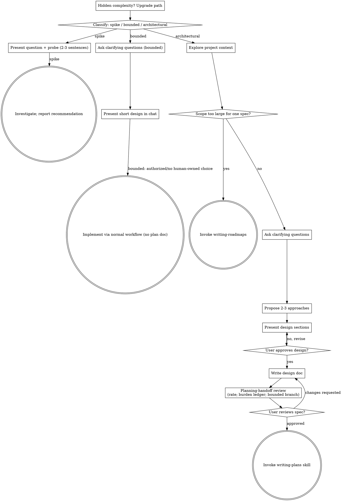

## Provenance

This marketplace-maintained derivative is based on `obra/superpowers` v6.4.1 commit `5bf4e78011075bcfc0dc295f0724994cd123ee71` under the MIT License. Upstream source is not vendored; this directory contains the maintained Superpowers+ implementation.

# Brainstorming Ideas Into Designs

Help turn ideas into fully formed designs and specs through natural collaborative dialogue.

Start by classifying how much process the request needs, then work
through your path: understand the context, refine the idea, and make the
smallest decision record that protects the consequential choices.
The ceremony scales with uncertainty and consequence; approval is not a
universal ritual.

## Establish Shared Understanding

The outcome of brainstorming is an understanding your human partner can
recognize and correct, grounded in what they want to accomplish.

1. **Discover intent.** Use the request and available context to identify the
   intended outcome, who it is for, and what success looks like. When that
   information is missing and materially changes the design, ask one focused
   question about purpose or intended use before proposing an approach.
2. **Write back your understanding.** Briefly reflect the intended outcome,
   relevant constraints, and success criteria. Separate supplied facts from
   assumptions so the human can correct the design basis.
3. **Carry intent into the selected path.** Preserve that understanding in the
   architectural spec, bounded in-chat design, or spike question. Check
   technical choices against it.

When the request already supplies purpose, audience, constraints, and success,
reflect them and do not ask the same questions again. For already-authorized
bounded work, this reflection is part of the short design, not a new approval
pause.

<HARD-GATE>
Do NOT invoke any implementation skill, write any code, scaffold any
project, or take implementation action while a consequential product,
canon, privacy, licensing, or authority decision is unresolved. An
architectural design still requires explicit human approval before
implementation. A clear bounded change may proceed from its short design
when the task is already authorized and no human-owned decision remains.
</HARD-GATE>

## Three Paths

Before your first question, classify the request and say the
classification out loud — "this looks bounded, so I'll present a short
design here rather than write a spec" — so your human partner can
override it:

- **Spike** — a feasibility question ("can we...", "is it possible...",
  "quick and dirty is fine") whose output is an answer, not code you
  keep. Present the question and what you'll try in 2-3 sentences, then
  find out as cheaply as correctness allows. No design
  doc, no spec file. Report findings as a recommendation; anything you
  built stays labeled throwaway.
- **Bounded** — a well-scoped change to code that already exists in
  this repo: a new flag, a small endpoint, a one-file fix.
  Understanding the kind of app is not enough — bounded means the flow
  you are changing is already here to read. If there is no existing
  flow to change, the task is not bounded. Ask the clarifying
  questions that matter, present a short design IN CHAT (a few
  sentences to a few short paragraphs). If the task is authorized and
  the design contains no unresolved human-owned choice, proceed through
  the normal implementation workflow; otherwise stop for the specific
  decision. No spec file, no implementation plan document.
- **Architectural** — new projects, new subsystems, changes that
  restructure how components fit together or alter interfaces others
  depend on. Follow the full process: questions, approaches, sectioned
  design, written spec, then the writing-plans skill.

When in doubt between two paths, take the heavier one. The ratchet is
one-way: hidden complexity discovered mid-task upgrades the path —
stop, say so, and step up. Nothing downgrades mid-task.

### Tiny bounded sketch

When the human asks only for one implementation approach to a fully specified,
local, reversible change, answer with the smallest useful design: name the
technical assumption, the proposed edit, and the focused proof. Do not inspect
the repository unless the assumption cannot be stated from supplied context,
and do not invent an approval pause when no human-owned choice remains.

## Anti-Pattern: "Too Simple To Need A Design"

Every path must expose the assumptions that could change the outcome. A
todo list, a single-function utility, or a config change may need only a
two-sentence decision record. Approval is reserved for unresolved
human-owned choices and architectural designs; clear, already-authorized
bounded work does not need a ceremonial pause.

## Red Flags

| Thought | Reality |
|---------|---------|
| "This is too simple to need a design" | Simple means a short decision record, not hidden assumptions. |
| "I'll call it bounded and skip the spec" | Bounded work still needs an observable goal, touched seam, and acceptance check; take the heavier path when the existing flow is not clear. |
| "It's bounded and the design is obvious" | Proceed only when the task is authorized and no human-owned choice remains; stop on a real decision, not for ceremony. |
| "I understand this kind of app, so it's bounded" | Bounded measures the repo, not your familiarity. A new project has no existing flow — it is architectural. |
| "The spike works, so I'll keep the code" | A spike's output is an answer. Keeping the code is a new request — classify it. |
| "It grew, but I'm almost done — no need to re-classify" | Hidden complexity upgrades the path mid-task. Stop and say so. |
| "They approved the spike, so the follow-up change is approved too" | Each task gets its own classification; a human decision is required only when that task contains a human-owned choice. |

## Checklist

Classify first, announce the path, then create a task for each item on
your path and complete them in order.

**Spike:**
1. **Explore project context** — enough to frame the probe
2. **Present question + probe plan** — 2-3 sentences
3. **Investigate** — as cheaply as correctness allows
4. **Report findings** — a recommendation; label anything built as throwaway

**Bounded:**
1. **Explore project context** — check files, docs, recent commits
2. **Ask clarifying questions** — one at a time, the ones that matter
3. **Present short design in chat** — approach, files touched, testing
4. **Resolve the gate if needed** — stop only for a human-owned decision or unresolved consequential choice
5. **Implement** — proceed with the normal development workflow (TDD applies); no plan document

**Architectural:**
1. **Load baseline and local guide** — read this skill's baseline (`references/design-baseline.md`) and the repo's `.agents/runbooks/design.md` before executing the stage checklist.
2. **Explore project context** — check files, docs, recent commits
3. **Ask clarifying questions** — one at a time, understand purpose/constraints/success criteria
4. **Propose 2-3 approaches** — with trade-offs and your recommendation
5. **Present design** — in sections scaled to their complexity, get user approval after each section
6. **Write design doc** — save to `.agents/specs/YYYY-MM-DD-<topic>-design.md` and commit
7. **Planning-handoff review** — simulate the next planning stage, rate and inventory its burdens, and take the required bounded branch (see below)
8. **User reviews written spec** — ask the user to review the selected spec before proceeding; keep private review diagnostics private.
9. **Transition to implementation** — invoke writing-plans skill to create implementation plan

## Process Flow

**Terminal states are path-bound.** Architectural: the ONLY skill you
invoke after brainstorming is writing-plans — never frontend-design,
mcp-builder, or any other implementation skill. Bounded: after the short
design is settled and no human-owned choice remains, implementation proceeds
directly through the normal development workflow; no plan document. Spike:
the terminal state is a reported recommendation.

## The Process

The subsections below serve the bounded and architectural paths (a
spike stops after presenting the probe and reporting its recommendation).
Sections from
**Exploring approaches** onward are architectural-path depth — for
bounded work, context plus a few questions plus a short in-chat design
is the whole process.

**Understanding the idea:**

- Check out the current project state first (files, docs, recent commits)
- Before asking detailed questions, assess scope: if the request describes multiple independent subsystems (e.g., "build a platform with chat, file storage, billing, and analytics"), flag this immediately. Don't spend questions refining details of a project that needs to be decomposed first.
- If the project is too large for a single spec, stop and invoke `writing-roadmaps` to build a sequenced roadmap and write Plan 1. Do not brainstorm the whole epic in one pass or continue with detailed design questions until Plan 1 is approved.
- For appropriately-scoped projects, ask questions one at a time to refine the idea
- Prefer multiple choice questions when possible, but open-ended is fine too
- Only one question per message - if a topic needs more exploration, break it into multiple questions
- If a single missing fact blocks the next step, invoke `asking-clarifying-questions` before guessing.
- Focus on understanding: purpose, constraints, success criteria

**Exploring approaches:**

- Propose 2-3 different approaches with trade-offs
- Present options conversationally with your recommendation and reasoning
- Lead with your recommended option and explain why
- YAGNI ruthlessly - remove unnecessary features from every approach and design

**Presenting the design:**

- Once you believe you understand what you're building, present the design
- Scale each section to its complexity: a few sentences if straightforward, up to 200-300 words if nuanced
- Ask after each section whether it looks right so far
- Cover: architecture, components, data flow, error handling, testing
- Be ready to go back and clarify if something doesn't make sense

**Design for isolation and clarity:**

- Break the system into smaller units that each have one clear purpose, communicate through well-defined interfaces, and can be understood and tested independently
- For each unit, you should be able to answer: what does it do, how do you use it, and what does it depend on?
- Can someone understand what a unit does without reading its internals? Can you change the internals without breaking consumers? If not, the boundaries need work.
- Smaller, well-bounded units are also easier for you to work with - you reason better about code you can hold in context at once, and your edits are more reliable when files are focused. When a file grows large, that's often a signal that it's doing too much.

**Working in existing codebases:**

- Explore the current structure before proposing changes. Follow existing patterns.
- Where existing code has problems that affect the work (e.g., a file that's grown too large, unclear boundaries, tangled responsibilities), include targeted improvements as part of the design - the way a good developer improves code they're working in.
- Don't propose unrelated refactoring. Stay focused on what serves the current goal.

## After the Design (architectural path)

**Documentation:**

- Write the validated design (spec) to `.agents/specs/YYYY-MM-DD-<topic>-design.md`
  - (User preferences for spec location override this default)
- Use elements-of-style:writing-clearly-and-concisely skill if available
- Commit the design document to git

**Planning-Handoff Review:**
This is the spec self-review. Before asking for review, set the conversation
aside and temporarily act as a fresh planning agent whose only inputs are the
finished spec and the repository. Begin mapping how you would turn the spec
into an implementation plan, but do not write that plan. Trace each affected
entry point through the relevant components and state transitions. Note each
point where planning would require you to rediscover design intent or invent a
binding decision rather than choose an implementation detail. Include
placeholders, internal contradictions, scope problems, and ambiguous
requirements in this assessment; they are handoff seams, not a separate review
stage.

Rate the spec's planning-handoff readiness from 0.0–9.9 and explain what
prevents the next higher rating using repository and artifact evidence:
0 = reject; 2 = major redesign; 4 = substantial design rescue; 6 = usable but
planning must reconstruct a binding decision; 8 = handoff-ready with only
planning-owned choices; 9.9 = rare exemplary ceiling, never perfection. The
rating prompts the assessment; it does not decide whether the artifact improves.

Translate every design-owned reason preventing the next higher rating into a
burden ledger before editing. One burden is one independent binding decision or
piece of design reconstruction the planning agent must resolve before it can
specify implementation work. Record planning-owned choices separately rather
than counting them as burdens. For each burden, state the repository or artifact
evidence, what the planner would have to invent, and its weight:

- **minor (1):** a localized clarification or reconstruction;
- **major (2):** an unresolved binding decision or cross-component design
  uncertainty. Record contradictions and departures from the approved design
  separately; they are not ordinary tradeable burdens.

After the initial rating and ledger, take exactly one branch:

- If the rating is below 9.0 **or** the ledger contains any burden, preserve the
  initial draft, return to the spec-writer role, and make one bounded improvement
  pass targeting the evidence-based reasons preventing 9.0 and the named
  burdens. Do not resolve a purely planning-owned choice merely to raise the
  rating.
- Only if the rating is at least 9.0 **and** the burden ledger is empty, make no
  edit.

The bounded pass is the only review-driven editing phase after the first
complete draft. It may clarify, reconcile, and complete the spec using the
approved design, stated requirements, and repository evidence; preserve the
binding decisions already approved in the conversation. When an improvement
would require a new or changed binding design decision, leave it as a burden
instead of choosing it.

After the pass, close editing and reassess both versions read-only. Trace every
concept changed by the pass through the whole spec, including the state model,
entry points, failure/recovery rules, and acceptance criteria. Give a fresh
rating, build the final burden ledger from scratch, and compare it with the
initial ledger. Include burdens that moved or appeared elsewhere. Check
separately for a newly introduced major burden, contradiction, departure from
approved design, or scope change. More specific wording is not automatically an
improvement.

Select the revised draft only when its total weighted burden is lower and it
introduces no new major burden, contradiction, or design departure. New minor
burdens are permitted only when the total burden still falls. Otherwise restore
the preserved initial draft. Restoring the original is the only spec mutation
permitted after reassessment: do not fix the revised draft or begin another
pass. Present the selected spec through the normal user review handoff.
Keep the ratings, burden ledgers, and comparison in your private review; do not
add them to the spec or require them as a separate handoff artifact.
If the original was restored, mention briefly that the tentative revision was
rejected and the original retained; do not add a separate review artifact.

Accept, restore, and report based on burden—not whether the rating rose. The
review never grants permission to begin planning. Do not produce task
sequencing, invoke `writing-plans`, or repeat the pass.

**User Review Gate:**
After the spec review loop passes, ask the user to review the written spec before proceeding:

> "Spec written and committed to `<path>`. Please review it and let me know if you want to make any changes before we start writing out the implementation plan."

Wait for the user's response. If they request changes, make them and re-run the spec review loop. Only proceed once the user approves.

**Implementation:**

- Invoke the writing-plans skill to create a detailed implementation plan
- Do NOT invoke any other skill. writing-plans is the next step.
